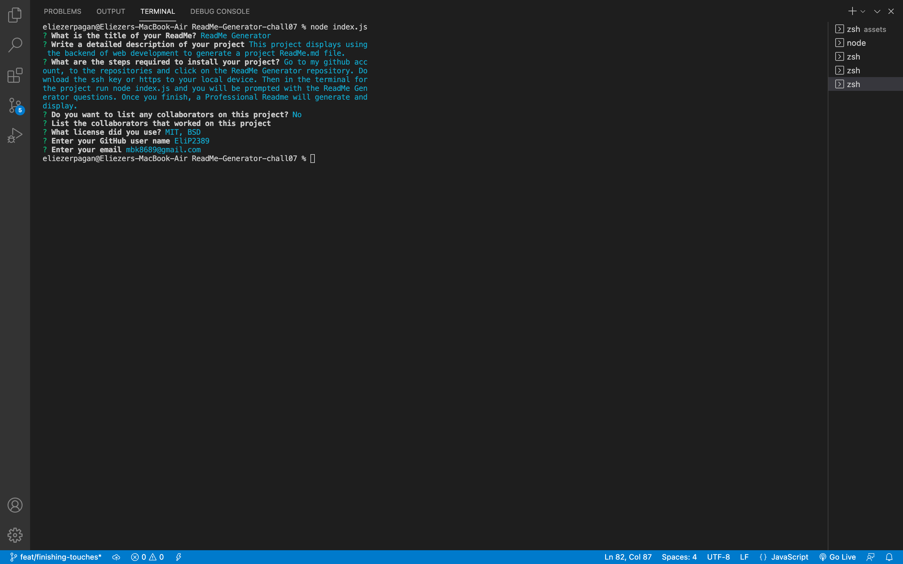
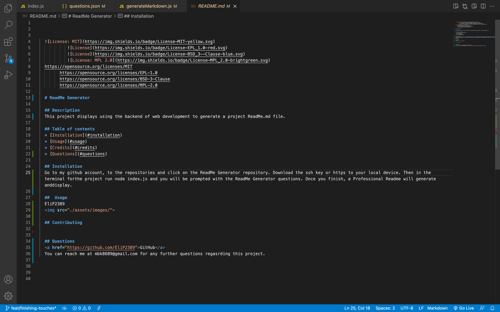

  
  

  # ReadMe Generator

  ## Description
  Dynamically creating a professional readme.md file, using backing technology with node.js

  ## Table of contents
  * [Installation](#installation)
  * [Usage](#usage)
  * [Credits](#credits)
  * [Questions](#questions)

  ## Installation
  clone ssh key to local device   npm init   npm install inquirer

  ##  Usage
  
  

  <a href="https://watch.screencastify.com/v/f1ToW1hfh8cVxxvjRppE">ReadMe Demo</a>

  ## Contributing
  

  ## License
  MIT

  ## Tests
  node index.js   answer all prompted questions

  ## Questions
  <a href="https://github.com/EliP2389">GitHub</a>
  You can reach me at mbk8689@gmail.com for any further questions regarding this project.

